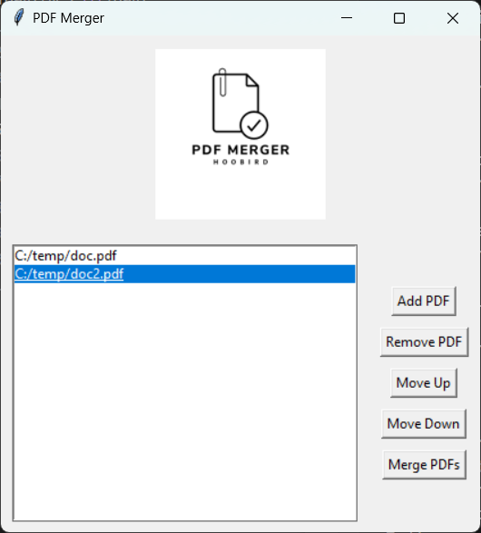

Here's the updated README with a "Requirements" section that lists the necessary libraries:

# PDF Merger



## Requirements

Make sure you have the following libraries installed:

- [`tkinter`](command:_github.copilot.openSymbolFromReferences?%5B%22tkinter%22%2C%5B%7B%22uri%22%3A%7B%22%24mid%22%3A1%2C%22fsPath%22%3A%22c%3A%5C%5CUsers%5C%5CHubert%5C%5COneDrive%5C%5C!Python%20Projects%5C%5CPDFMerge%5C%5Cmain.py%22%2C%22_sep%22%3A1%2C%22external%22%3A%22file%3A%2F%2F%2Fc%253A%2FUsers%2FHubert%2FOneDrive%2F%2521Python%2520Projects%2FPDFMerge%2Fmain.py%22%2C%22path%22%3A%22%2FC%3A%2FUsers%2FHubert%2FOneDrive%2F!Python%20Projects%2FPDFMerge%2Fmain.py%22%2C%22scheme%22%3A%22file%22%7D%2C%22pos%22%3A%7B%22line%22%3A0%2C%22character%22%3A7%7D%7D%5D%5D "Go to definition"): Standard Python interface to the Tk GUI toolkit.
- `Pillow`: Python Imaging Library (PIL) fork.
- `PyPDF2`: A library for working with PDF files.

You can install the required libraries using pip:

```sh
pip install pillow PyPDF2
```

## Instructions

### Add PDF
- **Button:** Add PDF
- **Description:** Opens a file dialog to select PDF files to add to the list. Selected files will be displayed in the listbox.

### Remove PDF
- **Button:** Remove PDF
- **Description:** Removes the selected PDF from the list.

### Move Up
- **Button:** Move Up
- **Description:** Moves the selected PDF up in the list.

### Move Down
- **Button:** Move Down
- **Description:** Moves the selected PDF down in the list.

### Merge PDFs
- **Button:** Merge PDFs
- **Description:** Merges all the PDFs in the list into a single PDF file. A file dialog will prompt you to save the merged PDF.

## Running the Application

To run the application, execute the following command:

```sh
python main.py
```

This will open the PDF Merger GUI where you can add, remove, reorder, and merge PDF files.